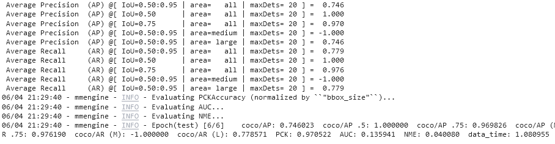
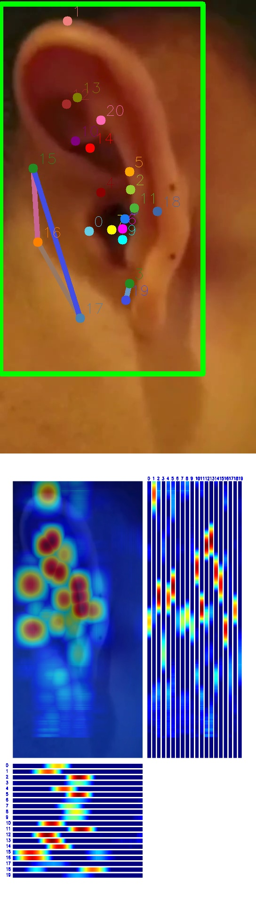

## 第一次作业

作业要求见：https://github.com/open-mmlab/OpenMMLabCamp/issues/93

训练全流程代码见 ./main.ipynb

目标检测模型使用示例配置文件 rtmdet_tiny_ear.py 。训练 120 epoch 在测试集上得分为：

关键点检测模型使用示例配置文件 rtmpose-s-ear.py 。 训练 300 epoch 在测试集上得分为：

测试自己上传的耳朵图片，输出为：

