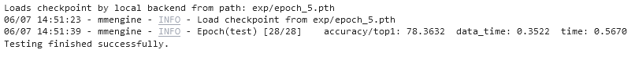

## 第二次作业

作业要求见：https://github.com/open-mmlab/OpenMMLabCamp/issues/108

训练全流程代码见 ./main.ipynb

训练配置文件见 ./projects/fruit/resnet50_finetune.py

在验证集上的准确率为：

该模型已上传至百度网盘：

链接：https://pan.baidu.com/s/18LsqYGDtzsLZBMZN2cxv6A 

提取码：ovec 
