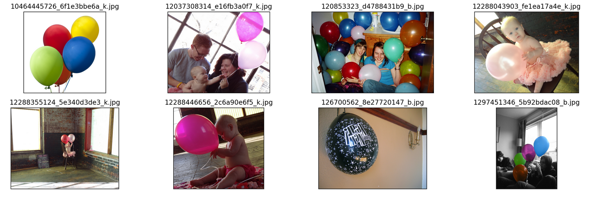
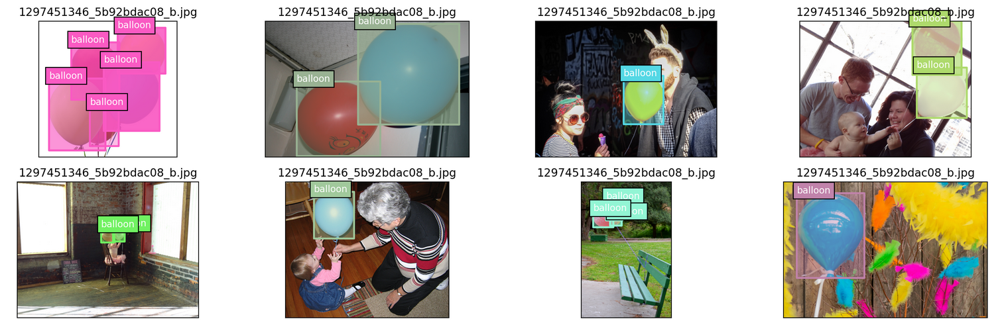
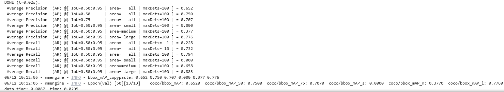
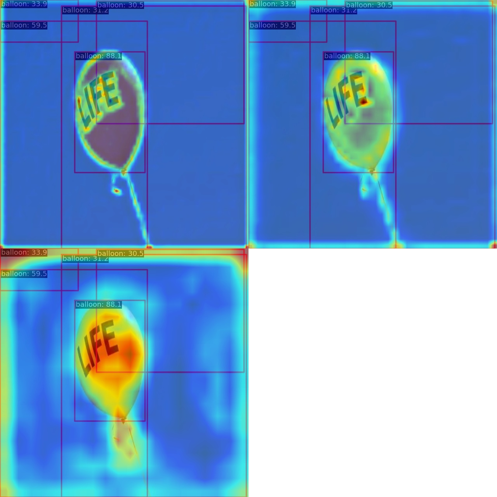
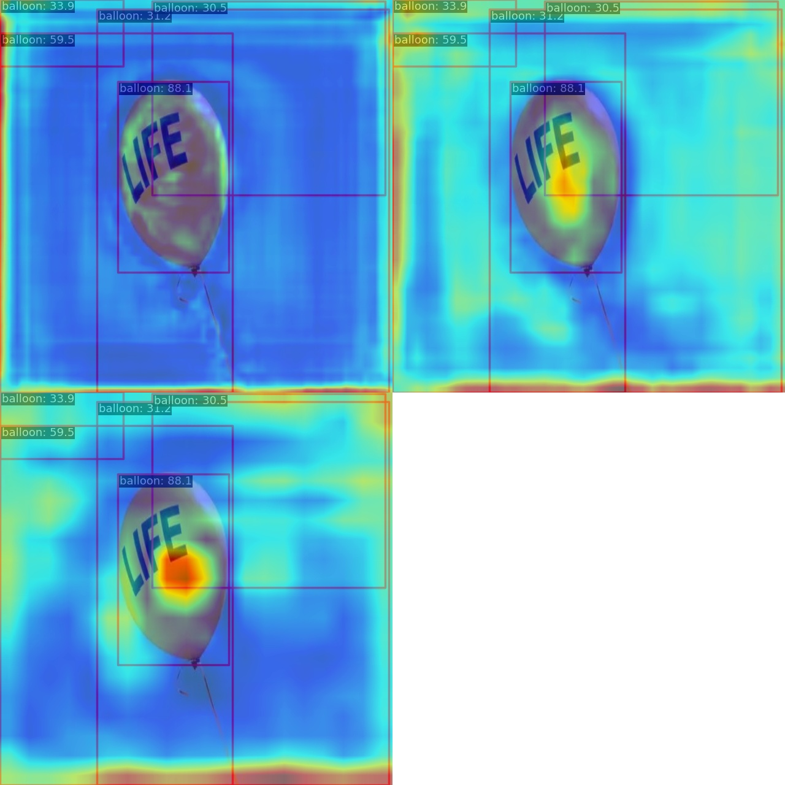
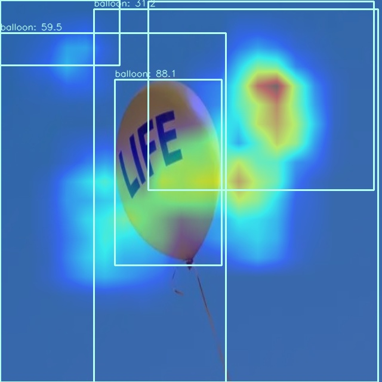

# 【AI实战营第二期】第三次作业 By Jayce Ning

**作业**：基于 RTMDet 的气球检测

**背景**：熟悉目标检测和 MMDetection 常用自定义流程。

**任务**：

1. 基于提供的 notebook，将 cat 数据集换成气球数据集
2. 按照视频中 notebook 步骤，可视化数据集和标签
3. 使用MMDetection算法库，训练 RTMDet 气球目标检测算法，可以适当调参，提交测试集评估指标
4. 用网上下载的任意包括气球的图片进行预测，将预测结果发到群里
5. 按照视频中 notebook 步骤，对 demo 图片进行特征图可视化和 Box AM 可视化，将结果发到群里

需提交的测试集评估指标（不能低于baseline指标的50%）

* 目标检测 RTMDet-tiny 模型性能不能 65 mAP

**数据集**

气球数据集可以直接下载 https://download.openmmlab.com/mmyolo/data/balloon_dataset.zip

## 作业代码

详见 main.ipynb

### 数据集可视化

balloon 数据集可视化

balloon 数据集标注框可视化

### 训练结果

### 预测结果

### 特征图可视化

### Box AM 可视化

