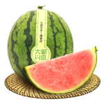
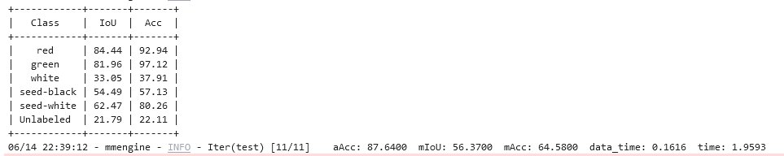
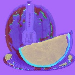

# 【AI实战营第二期】第四次作业 By Jayce Ning

**作业：** MMSeg 语义分割

**背景：** 西瓜瓤、西瓜皮、西瓜籽像素级语义分割

TO DO LIST：

1. Labelme 标注语义分割数据集（子豪兄已经帮你完成了）
2. 划分训练集和测试集（子豪兄已经帮你完成了）
3. Labelme 标注转 Mask 灰度图格式（子豪兄已经帮你完成了）
4. 使用 MMSegmentation 算法库，撰写 config 配置文件，训练 PSPNet 语义分割算法
5. 提交测试集评估指标
6. 自己拍摄西瓜图片和视频，将预测结果发到群里
7. （选做）训练 Segformer 语义分割算法，提交测试集评估指标

**西瓜瓤、西瓜籽数据集：**

标注：同济子豪兄

**数据集下载链接：**

* Labelme标注格式（没有划分训练集和测试集）：https://zihao-openmmlab.obs.cn-east-3.myhuaweicloud.com/20230130-mmseg/dataset/watermelon/Watermelon87_Semantic_Seg_Labelme.zip

* Mask标注格式（已划分训练集和测试集）：https://zihao-openmmlab.obs.cn-east-3.myhuaweicloud.com/20230130-mmseg/dataset/watermelon/Watermelon87_Semantic_Seg_Mask.zip

**需提交的测试集评估指标：（不能低于 baseline 指标的 50% ）**

aAcc: 60.6200
mIoU: 21.1400
mAcc: 28.4600

## 作业代码

详见 main.ipynb

### 测试图片

### 训练结果

### 预测结果

